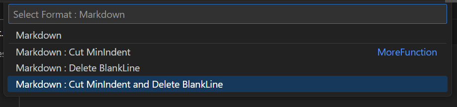

# Copy Format Code

[](https://marketplace.visualstudio.com/items?itemName=SatoshiYamamoto.vscode-copy-format-code)
[](https://marketplace.visualstudio.com/items?itemName=SatoshiYamamoto.vscode-copy-format-code)
[](https://marketplace.visualstudio.com/items?itemName=SatoshiYamamoto.vscode-copy-format-code)
[](https://github.com/standard-software/vscode-copy-format-code/blob/main/LICENSE)

This extension can be formatted and processed to copy text to the clipboard.

It has the following formatting features
- Line numbers can be added.
- Include file names and absolute or relative paths in headers and footers.
- Copying without blank lines.
- Remove the minimum indentation in the copied area.
- You can trim the beginning or end of a line.
- You can fill spaces to the end of a line.

## Install

Copy Format Code - Visual Studio Marketplace  
https://marketplace.visualstudio.com/items?itemName=SatoshiYamamoto.vscode-copy-format-code

## GitHub

standard-software/vscode-copy-format-code  
https://github.com/standard-software/vscode-copy-format-code

## Contact

standard.software.net@gmail.com  
Japanese / English

## Usage

### Command

```
[ Copy Format Code : Copy : Format 1 ]
[ Copy Format Code : Copy : Format 2 ]
[ Copy Format Code : Copy : Format 3 ]
[ Copy Format Code : Select Format... ]
```

| Command         | Default Function                                | Default Key Windows     | Default Key Mac         |
|-                |-                                                |-                        | -                       |
| Copy : Format 1 | Markdown LineNumber                             | Alt + Ctrl + C          | Opt + Ctrl + C          |
| Copy : Format 2 | Markdown                                        | Alt + Shift + C         | Opt + Shift + C         |
| Copy : Format 3 | Header RelativePath LineNumber : Cut MinIndent  | Alt + Ctrl + Shift + C  | Opt + Ctrl + Shift + C  |

### [ Copy Format Code : Copy : Format 1,2,3 ]

Selecting multiple selections and this command will copy them to the clipboard according to your settings.

To change the settings, edit the setting.json.

[Default Setting ./SETTING_SAMPLE.md](./SETTING_SAMPLE.md)


### [ Copy Format Code : Select Format ... ]

If you specify multiple selections and select this command, you can choose a function according to the menu settings below.

The text formatted with the content of the selected items is copied to the clipboard.


Default Setting
```
- Copy Format Code : Select Format ...
  - Markdown >>
      - Markdown
      - Markdown : Cut MinIndent
      - Markdown : Delete BlankLine
      - Markdown : Cut MinIndent and Delete BlankLine
  - Markdown LineNumber >>
      - Markdown LineNumber
      - Markdown LineNumber : Cut MinIndent
      - Markdown LineNumber : Delete BlankLine
      - Markdown LineNumber : Cut MinIndent and Delete BlankLine
  - Header RelativePath >>
      - Header RelativePath
      - Header RelativePath : Cut MinIndent
      - Header RelativePath : Delete BlankLine
      - Header RelativePath : Cut MinIndent and Delete BlankLine
  - Header RelativePath LineNumber >>
      - Header RelativePath LineNumber
      - Header RelativePath LineNumber : Cut MinIndent
      - Header RelativePath LineNumber : Delete BlankLine
      - Header RelativePath LineNumber : Cut MinIndent and Delete BlankLine
  - Other >>
      - Delete Indent >>
          - Markdown  : Delete Indent
          - Markdown LineNumber : Delete Indent
          - Header RelativePath : Delete Indent
          - Header RelativePath LineNumber : Delete Indent
      - Fill Spaces EndOfLine >>
          - Markdown : Fill Spaces EndOfLine
          - Markdown LineNumber : Fill Spaces EndOfLine
          - Header RelativePath : Fill Spaces EndOfLine
          - Header RelativePath LineNumber : Fill Spaces EndOfLine
      - Delete Indent and Fill Spaces EndOfLine >>
          - Markdown : Delete Indent and Fill Spaces EndOfLine
          - Markdown LineNumber : Delete Indent and Fill Spaces EndOfLine
          - Header RelativePath : Delete Indent and Fill Spaces EndOfLine
          - Header RelativePath LineNumber : Delete Indent and Fill Spaces EndOfLine
```

## Output Sample

### Markdown
> ~~~
> ```txt : TestFile/test.txt : 3-17
> 
>   item 1
>   
> 
>     item 1-1          
>       item 1-1-1
>       item 1-1-2
>     item 1-2
> 
>   
>     
>   item 2
>     item 2-1
>     item 2-2
> ```
> ~~~

### Markdown LineNumber : Cut MinIndent
> ~~~
> ```txt : TestFile/test.txt
> 03: 
> 04: item 1
> 05: 
> 06: 
> 07:   item 1-1          
> 08:     item 1-1-1
> 09:     item 1-1-2
> 10:   item 1-2
> 11: 
> 12: 
> 13:   
> 14: item 2
> 15:   item 2-1
> 16:   item 2-2
> 17: 
> ```
> ~~~

### Header RelativePath : Delete BlankLine
> ~~~
> TestFile/
> test.txt : 3-17
>   item 1
>     item 1-1          
>       item 1-1-1
>       item 1-1-2
>     item 1-2
>   item 2
>     item 2-1
>     item 2-2
> ~~~

### Header RelativePath LineNumber : Cut MinIndent and Delete BlankLine
> ~~~
> TestFile/
> test.txt
> 04: item 1
> 07:   item 1-1          
> 08:     item 1-1-1
> 09:     item 1-1-2
> 10:   item 1-2
> 14: item 2
> 15:   item 2-1
> 16:   item 2-2
> ~~~

## Setting

settings.json can be found in the following file.

[Default Setting ./SETTING_SAMPLE.md](./SETTING_SAMPLE.md)

### Setting Specifications

```json
{
  "CopyFormatCode.CopyFormat1": {
    "label": "Markdown LineNumber",
    "format": {
      "header": "```%FileExt% : %FolderPathRelativeProjectSlash%/%FileName%",
      "body": "%NumberFile%: %Line%",
      "bodySeparator": ":",
      "footer": "```"
    }
  },
  "CopyFormatCode.CopyFormat2": {
    "label": "Markdown",
    "format": {
      "header": "```%FileExt% : %FolderPathRelativeProjectSlash%/%FileName% : %NumberStart%-%NumberEnd%",
      "body": "%Line%",
      "bodySeparator": ":",
      "footer": "```"
    }
  },
  "CopyFormatCode.CopyFormat3": {
    "label": "Header RelativePath LineNumber : Cut MinIndent",
    "format": {
      "header": "%FolderPathRelativeProjectSlash%/\n%FileName%",
      "body": "%NumberFile%: %LineCutMinIndent%",
      "bodySeparator": ""
    }
  },
  "CopyFormatCode.SelectFormatMenu": [
    {
      "label": "Markdown",
      "format": {
        "header": "```%FileExt% : %FolderPathRelativeProjectSlash%/%FileName% : %NumberStart%-%NumberEnd%",
        "body": "%Line%",
        "bodySeparator": ":",
        "footer": "```"
      }
    },
    {
      "label": "Markdown LineNumber : Cut MinIndent",
      "format": {
        "header": "```%FileExt% : %FolderPathRelativeProjectSlash%/%FileName%",
        "body": "%NumberFile%: %LineCutMinIndent%",
        "bodySeparator": ":",
        "footer": "```"
      }
    },
    {
      "label": "Header RelativePath : Delete BlankLine",
      "format": {
        "header": "%FolderPathRelativeProjectSlash%/\n%FileName% : %NumberStart%-%NumberEnd%",
        "body": "%SkipBlankLine%%Line%",
        "bodySeparator": ""
      }
    },
    {
      "label": "Header RelativePath LineNumber : Cut MinIndent and Delete BlankLine",
      "format": {
        "header": "%FolderPathRelativeProjectSlash%/\n%FileName%",
        "body": "%NumberFile%: %LineCutMinIndent%%SkipBlankLine%",
        "bodySeparator": ""
      }
    }
  ],
}
```

###  format header

| Format Text                       | value                                   | note                                                                                  |
|-                                  |-                                        |-                                                                                      |
| %FilePath%                        | C:\workspace\project\TestFile\test.txt  | Full path of a file                                                                   |
| %FilePathSlash%                   | C:/workspace/project/TestFile/test.txt  | Full path of a file<br>convert \ to / for Windows                                                            |
| %FileName%                        | test.txt                                | File name                                                                             |
| %FileNameWithoutExt%              | test                                    | File name without ext                                                                 |
| %FileExt%                         | txt                                     | File ext                                                                              |
|                                   |                                         |                                                                                       |
| %FolderPath%                      | C:\workspace\project\TestFile           | Folder path                                                                           |
| %FolderPathSlash%                 | C:/workspace/project/TestFile           | Folder path<br>convert \ to / for Windows                                             |
| %FolderName%                      | TestFile                                | Folder name                                                                           |
|                                   |                                         |                                                                                       |
| %FilePathRelative%                | TestFile\test.txt                       | Relative path of the file                                                             |
| %FilePathRelativeSlash%           | TestFile/test.txt                       | Relative path of the file<br>convert \ to / for Windows                               |
| %FolderPathRelative%              | TestFile                                | Relative path of the folder                                                           |
| %FolderPathRelativeSlash%         | TestFile                                | Relative path of the folder<br>convert \ to / for Windows                             |
|                                   |                                         |                                                                                       |
| %FilePathRelativeProject%         | project\TestFile\test.txt               | Relative path to the file containing the project name                                 |
| %FilePathRelativeProjectSlash%    | project/TestFile/test.txt               | Relative path to the file containing the project name<br>convert \ to / for Windows   |
| %FolderPathRelativeProject%       | project\TestFile                        | Relative path to the folder containing the project name                               |
| %FolderPathRelativeProjectSlash%  | project/TestFile                        | Relative path to the folder containing the project name<br>convert \ to / for Windows |
|                                   |                                         |                                                                                       |
| %ProjectFolderPath%               | C:\workspace\project\TestFile           | Project Folder Path                                                                   |
| %ProjectFolderPathSlash%          | C:/workspace/project/TestFile           | Project Folder Path<br>convert \ to / for Windows                                     |
| %ProjectName%                     | TestFile                                | Project file name                                                                     |
|                                   |                                         |                                                                                       |
| %NumberStart%                     | 3                                       | First line number of the selection                                                    |
| %NumberStartZeroPad%              | 03                                      | First line number of the selection, padded with leading zeros                         |
| %NumberEnd%                       | 17                                      | End line number of the selection                                                      |
|                                   |                                         |                                                                                       |

### format body

| Format Text                         | note                                                                                                        |
|-                                    |-                                                                                                            |
| %NumberStart1%                      | Line numbers starting from 1                              |                                                 |
| %NumberFile%                        | File line number                                                                                            |
|                                     |                                                                                                             |
| %Line%                              | Text of line                                                                                                |
| %LineCutMinIndent%                  | Text of line with minimum indentation cut off                                                               |
| %LineTrim%                          | Text of line with front and back trimmed                                                                    |
| %LineTrimFirst%                     | Text of line with front trimmed                                                                             |
| %LineTrimLast%                      | Text of line with back trimmed                                                                              |
|                                     |                                                                                                             |
| %SpaceMinIndent%                    | Space for minimum indent (Tabs are not considered)                                                          |
| %SpacePadEnd%                       | Set to fill in the back of the line with spaces to align (supports Japanese double-byte character lengths.) |
|                                     |                                                                                                             |
| %SkipBlankLine%                     | Set to skip lines that would be blank if trimmed.                                                           |
|                                     |                                                                                                             |
| \%                                  | %                                                                                                           |
| \\                                  | \                                                                                                           |
|                                     |                                                                                                             |

### format bodySeparator

Setting up lines connecting multiple selections

| value                     | note                                                    |
|-                          |-                                                        |
| EmptyString               | Line break                                              |
| String of colons, etc.    | Strings and line breaks                                 |
| No setting (undefined)    | Multiple selections are connected without delimitation  |
|                           |                                                         |

### format footer

Same as format header setting

### Settings for menu structure

Separator
```json
    {
      "label": "MoreFunction",
      "separator": true
    },
```


SubMenu

```json
    {
      "label": "SubMenu",
      "items": [
        {
          ...
        },
        {
          ...
        }
      ]
    }
```

## Change log

[./CHANGELOG.md](./CHANGELOG.md)


